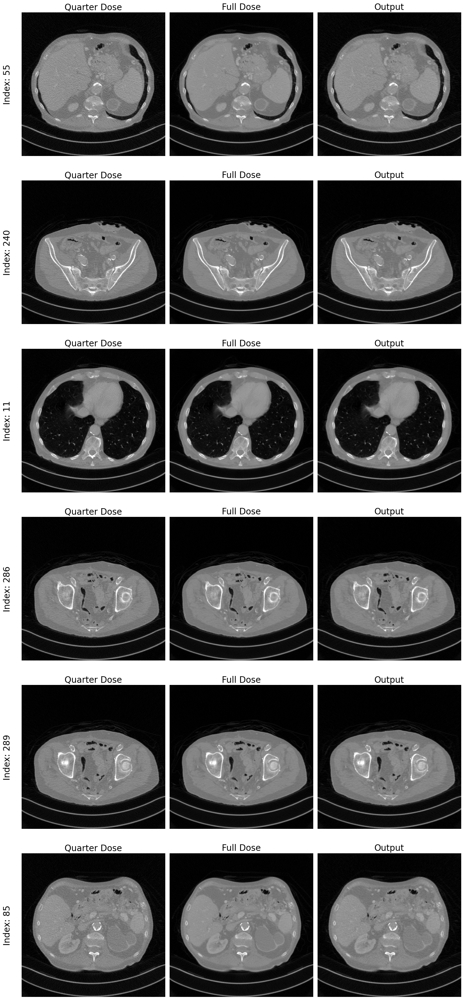
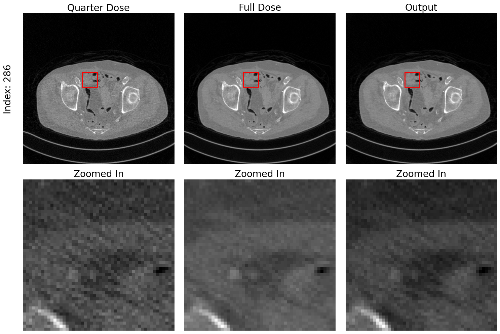
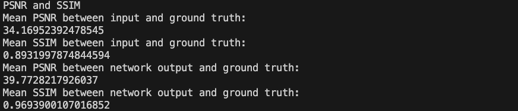
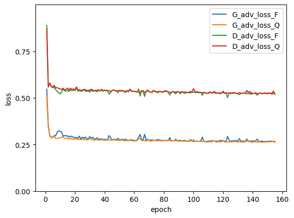
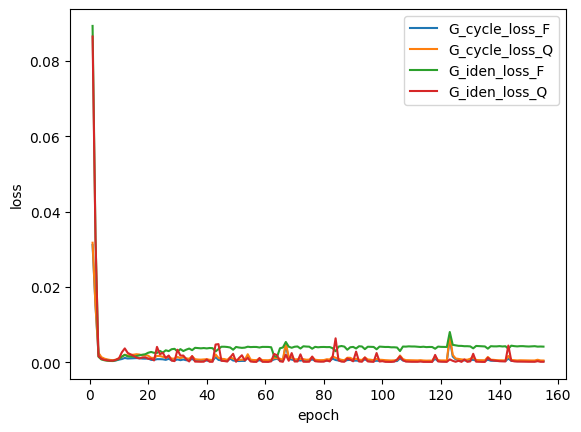
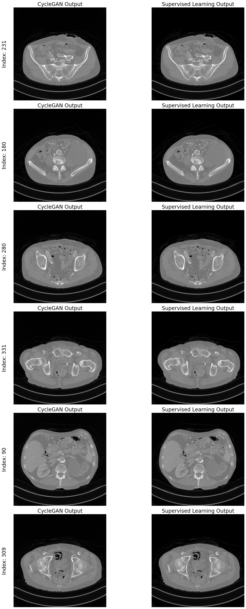
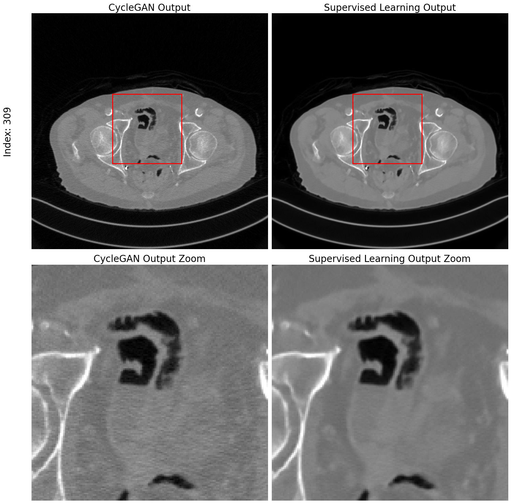

<h2 align="center">
    [KAIST AI618] CT Denoising with CycleGAN
</h2>
<h5 align="center">
    Seonho Lee<br>
    KAIST<br>
    20243597<br>
  <!-- <a href="https://arxiv.org/pdf/2203.11876.pdf">arXiv</a> |
  <a href="https://www.mmlab-ntu.com/project/ovdetr/index.html">Project Page</a> |
  <a href="https://github.com/yuhangzang/OV-DETR">Code</a> -->
</h5>

---

### Introduction

In this project, we implement a CycleGAN framework to improve the quality of CT images. This framework facilitates the transformation of noisy, low-dose CT images into their clean, high-dose equivalents through unpaired image-to-image translation. We explore the performance of generators trained under two different regimes: CycleGAN losses and supervised losses. Our results demonstrate that CycleGAN is capable of effectively denoising quarter-dose images into clear full-dose images without the need for paired training data. We assess our implementation both qualitatively and quantitatively, utilizing PSNR and SSIM metrics on a test dataset to evaluate the efficacy of the translated images.

<div align="center">
    
    <div>
    Comparison of input images quarter-dose, ground truth full-dose, and CycleGAN outputs. We randomly select six indices from the dataset and display corresponding tuples of images across each row.
    </div>
</div>


### Experimental Settings

Experiments were performed using an NVIDIA A6000 48GB GPU. We established a controlled experimental environment by setting a fixed random seed at 42 to ensure reproducibility. The training was conducted over 120 epochs, utilizing a batch size of 16. The network's learning rate was set to $2 \times 10^{-4}$.

For our CycleGAN model, the generator and discriminator architectures were configured with varying channel multipliers, specifically [1, 2, 4, 8], to progressively increase the complexity of feature extraction. The number of channels in the initial layers of the generator and discriminator was set to 32 and 64, respectively. Each model incorporated three residual blocks to enhance learning capability without a significant increase in computational demand.

Two crucial hyperparameters, $\lambda_{\text{cycle}}$ and $\lambda_{\text{iden}}$, were used to balance the cycle consistency and identity losses, set at 10 and 5, respectively. The Adam optimizer parameters, $\beta_1$ and $\beta_2$, were configured at 0.5 and 0.999 to optimize the training process.

AAPM Data for the experiments can be obtained from drive [link](https://drive.google.com/drive/folders/1v0K0mRaOFQPKnOCQKZt9yjWrQ1QMzkI0?usp=share_link), ensuring that all input data was consistently accessed and processed during the experimental runs.

<br/>

### Results


#### Qualitative Evaluation

<div align="center">
    
    <div>
    Zoom in images of quarter-dose, full-dose, and CycleGAN outputs.
    </div>
</div>

<br/>

#### Quantitative Evaluation

<div align="center">
    
    <div>
    Average PSNR and SSIM of all test data from input and CycleGAN outputs.
    </div>
</div>

<br/>

<div align="center">
    
    <div>
    The average PSNR and SSIM of all test data from input and supervised learning.
    </div>
</div>

<br/>

#### Graphs of Adversarial and Cycle Losses

<div align="center">
    
    
</div>

<br/>

#### Trained on CycleGAN Losses vs. Supervised Loss

<div align="center">
    
    <div>
    Comparison of CycleGAN outputs trained on CycleGAN losses and supervised loss. We randomly select six indices from the dataset and display corresponding tuples of images across each row.
    </div>
</div>

<div align="center">
    
    <div>
    Zoom in images of outputs trained on CycleGAN losses and supervised loss.
    </div>
</div>


<br/>

### Prepare Datasets

AAPM data used in this project is from this [drive link]([link](https://drive.google.com/drive/folders/1v0K0mRaOFQPKnOCQKZt9yjWrQ1QMzkI0?usp=share_link)).


### RUN


#### Training

##### Training Arguments

```
Arguments:
    --path_checkpoint PATH_CHECKPOINT
                        checkpoint path when using pre-trained model (default: ./CT_denoising)
    --model_name MODEL_NAME
                        model name (default: cyclegan_v1)
    --path_data PATH_DATA
                        path to data (default: ./AAPM_data)
    --batch_size BATCH_SIZE
                        batch size (default: 16)
    --lambda_cycle LAMBDA_CYCLE
                        lambda cycle (default: 10)
    --lambda_iden LAMBDA_IDEN
                        lambda identity (default: 5)  
    --beta1 BETA1         beta1 (default: 0.5)
    --beta2 BETA2         beta2 (default: 0.999)
    --num_epoch NUM_EPOCH
                        number of epochs (default: 120)
    --g_channels G_CHANNELS
                        number of channels in the generator (default: 32)
    --d_channels D_CHANNELS
                        number of channels in the discriminator (default: 64)
    --ch_mult CH_MULT [CH_MULT ...]
                        channel multipliers (default: [1, 2, 4, 8])
    --num_res_blocks NUM_RES_BLOCKS
                        number of residual blocks (default: 3)  
    --lr LR              learning rate (default: 2e-4)
    --seed SEED          random seed (default: 42)
    --use_checkpoint      use pre-trained checkpoint
```


##### Command

```bash
python train.py --path_data {DATASET_PATH} 
```

Below is an example of training the model with the provided dataset.

```bash
python train.py --path_data ../data/AAPM_data
```


#### Testing

##### Testing Arguments

```
Arguments:
    --path_checkpoint PATH_CHECKPOINT
                        checkpoint path when using pre-trained model (default: ./CT_denoising)
    --model_name MODEL_NAME
                        model name (default: cyclegan_v1)
    --path_data PATH_DATA
                        path to data (default: ./AAPM_data)
    --g_channels G_CHANNELS
                        number of channels in the generator (default: 32)
    --ch_mult CH_MULT [CH_MULT ...]
                        channel multipliers (default: [1, 2, 4, 8])
    --num_res_blocks NUM_RES_BLOCKS
                        number of residual blocks (default: 3)
    --seed SEED          random seed (default: 42)
    --num_visualize NUM_VISUALIZE
                        number of images to visualize (default: 6)
```

```bash
python test.py --path_data {DATASET_PATH} --use_checkpoint
```

Below is an example of testing the model with the provided dataset.

```bash
python test.py --path_data ../data/AAPM_data --use_checkpoint
```


### Acknowledgement

This project was conducted as part of the KAIST AI618 course.
